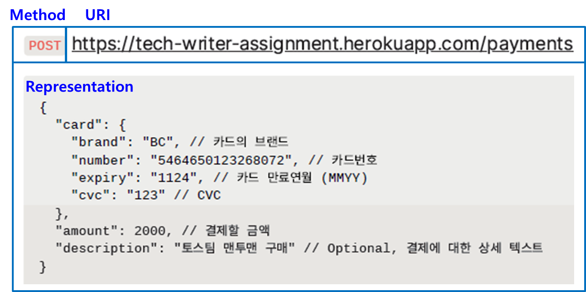

***********
1. API 소개
***********

|
1.1 결제 API란
==================================================

결제 API(Application Programming Interface)는 결제 서비스를 사용하기 위하여 `REST API <https://en.wikipedia.org/wiki/Representational_state_transfer>`_ 형태로 제공되는 클라이언트(요청) - 서버(처리 및 응답) 간의 인터페이스입니다.

결제 API는 `HTTP 프로토콜 <https://developer.mozilla.org/ko/docs/Web/HTTP/Overview>`_ 을 활용하므로 클라이언트와 서버간에 HTTP 요청 및 HTTP 응답을 전송할 수 있습니다.

|
1.2 API 구성 요소
==================

결제 API는 다음의 세 가지 요소로 구성됩니다.

* **URI** (Uniform Resource Identifier): 인터넷에 있는 특정 자원의 위치를 나타내는 유일한 주소
* **HTTP Method**: HTTP Request가 의도하는 행위를 정의
* **Representation** (표현): 클라이언트와 서버 간의 주고 받는 데이터(Body), 주로 JSON 혹은 XML 형식으로 데이터를 주고 받음

| Figure 1.2 결제 API 구성 

| HTTP Request 데이터가 `JSON (JavaScript Object Notation) <https://ko.wikipedia.org/wiki/JSON>`_ 형식이므로, HTTP Request 및 Response Header에 ``Content-Type`` 이 다음과 같이 포함됩니다.

.. code-block:: json 

       Content-Type: application/json
..

.. note:: URI 리소스에 대한 **HTTP Method** (GET, POST, PUT, DELETE) 종류는 다음과 같습니다.

    * ``GET``  : GET를 통해 해당 리소스를 조회하고 자세한 정보를 가져옵니다.
    * ``POST`` : POST를 통해 해당 URI를 요청하면 리소스를 생성합니다.
    * ``PUT``   : PUT를 통해 해당 리소스를 수정합니다.
    * ``DELETE`` : DELETE를 통해 리소스를 삭제합니다.   
..

.. warning:: 결제 API는 HTTPS 프로토콜만 지원합니다. HTTP로 요청하는 경우 실패하게 됩니다.

|
1.3 API 호출
==================

| 결제 API는 HTTP 통신이 가능한 환경이라면 어디서든 호출할 수 있습니다. 
| Window OS 기반 클라이언트 환경으로 `curl <https://curl.se/>`_ 및 명령 프롬프트 창을 사용할 수 있습니다.

해당 환경을 활용한 결제 API 호출하기 실습은 :ref:`2. API 호출하기 <doc_api_usage>` 에서 다루겠습니다.

.. hint:: curl 다운로드는 `여기 <https://curl.se/latest.cgi?curl=win64-ssl-sspi>`_ 를 참조하세요.

|
1.4 API 응답 처리
==================

결제 API는 HTTP 요청에 대한 성공 여부를 HTTP 상태 코드로 전달합니다.

각 요청에 대한 HTTP 상태 코드는 다음와 같습니다.

==================== ==========================================================
*상태 코드*           *설 명* 
 200 - OK             요청이 성공적으로 처리된 경우입니다.
 400 - Bad Request    | 요청을 처리할 수 없는 경우입니다.
                      | 필수 파라미터를 보내지 않았거나,   
                      | 파라미터 포맷이 잘못되면 이 응답이 돌아올 수 있습니다.
==================== ==========================================================

.. note:: | Response의 상태 코드가 ``200`` 이면 요청에 성공한 것이고 ``400`` 이면 요청에 실패한 것입니다. 
          | 결제 API에서 다루지 않는 그 밖의 상태 코드는 다음과 같습니다.

          | ``403`` - Forbidden      시크릿 키 없이 요청하거나 사용한 시크릿 키가 잘못된 경우입니다.
          | ``404`` - Not Found      요청한 리소스가 존재하지 않는 경우입니다.
          | ``500`` - Server Error   서버 에러가 발생한 경우입니다.   
..

