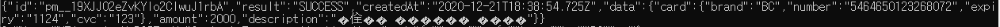
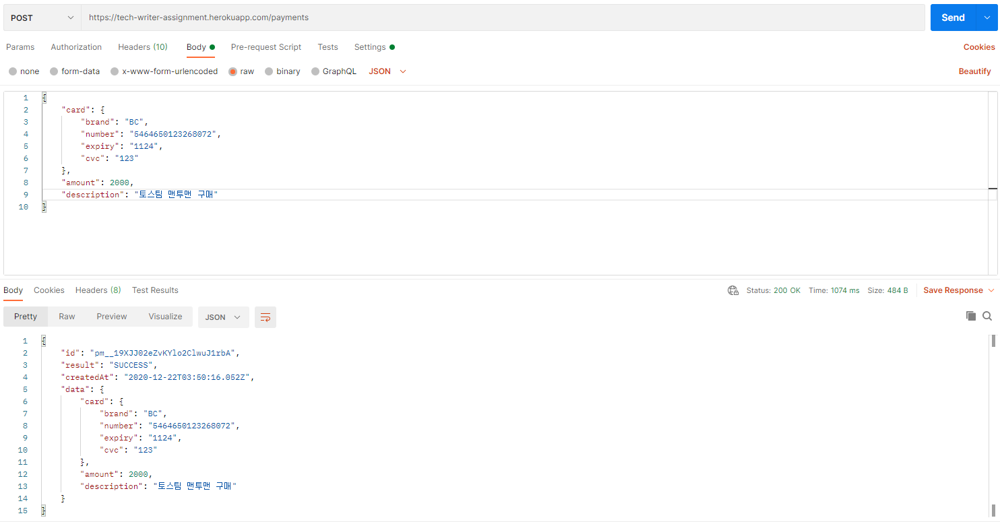

.. _doc_api_usage:

***************
2. API 호출하기
***************

이 장에서는 **curl** 실행 환경에서의 결제 API 요청 및 응답을 다룹니다.

결제 API 정보는 다음과 같습니다.

* **URI**: https://tech-writer-assignment.herokuapp.com/payments
* **HTTP Method**: ``POST``
* **Representation**: JSON

|
2.1 요청하기
============

다음과 같은 JSON 형식의 요청 본문(Body) 데이터를 전송할 수 있습니다.

.. code-block:: json

       {
          "card": {
          "brand": "BC", // 카드의 브랜드
          "number": "5464650123268072", // 카드번호
          "expiry": "1124", // 카드 만료연월 (MMYY)
          "cvc": "123" // CVC
           },
          "amount": 2000, // 결제할 금액
          "description": "토스팀 맨투맨 구매" // Optional, 결제에 대한 상세 텍스트
       }
..

위 본문 데이터에 대한 세부 정보는 다음과 같습니다.

==================== ============== ======================
*이름*                *타입*         *설명*
 card                 JSON Map       카드 정보
 brand                String         카드 브랜드
 number               String         카드 번호
 expiry               String         카드 만료 연월
 cvc                  String         CVC 코드          
 amount               number         결제할 금액 합계     
 description          String         결제에 대한 세부 내용
==================== ============== ======================

.. warning:: 본문 데이터 중 ``description`` 필드를 제외한 나머지 값들은 모두 필수이며 필수값 제외 시 에러 응답이 전송됩니다.

|
명령 프롬프트 창에서 curl을 사용한 결제 API 요청하기 명령어는 다음과 같습니다.

.. code-block:: bash

    curl -X POST -H "Content-Type: application/json" \
    -d "{ \"card\": { \"brand\": \"BC\", \"number\": \"5464650123268072\", \"expiry\": \"1124\", \"cvc\": \"123\" }, \"amount\": 2000, \"description\": \"토스팀 맨투맨 구매\" }" \
    https://tech-writer-assignment.herokuapp.com/paymentsnts
..

.. hint:: 명령 프롬프트 창에서 명령어가 길어질 경우 명령문 끝에 ``\`` 와 ``^`` 를 입력하여 줄바꿈을 할 수 있습니다. 아래 실제 화면을 참조하세요.

  .. image:: ../_static/tw/images/API_curl_01.png
     
..

.. warning:: | 위 요청 명령어에서 String 타입의 문자열 데이터는 큰따옴표 **""** 로 감싸주어야 합니다. 
             | 또한 큰따옴표 등의 특정 문자를 문자열에서 사용하려면 이스케이프 문자(역슬레쉬 ``\`` )를 큰따옴표 양쪽에 추가해야 합니다.
             | 예를 들어 문자열 ABC는 ``\"ABC\"`` 로 표현합니다.
..

.. note:: | 위 요청 명령어에서 사용된 curl 옵션에 대한 정보는 다음과 같습니다.

          | -X: -request, HTTP Method를 선택할 수 있다.
          | -H: --header, 헤더를 보낸다.
          | -d: --data, HTTP Post data를 전달한다.

    그 밖의 curl 옵션은 명령 프롬프트 창에서 ``curl –h`` 명령어를 실행하면 확인할 수 있습니다.
..
 
|
2.2 응답 확인
==============

결제 API에 대한 요청이 성공한 경우, 상태 코드 및 응답 본문 데이터는 다음과 같습니다.

* 상태 코드: ``200``
* 본문 데이터
  
  .. code-block:: json 

    {
    "id": "pm__19XJJ02eZvKYlo2ClwuJ1rbA", // 결제 ID
    "result": "SUCCESS", // 결제 실행 결과
    "createdAt": "2020-03-20T12:03:31.991Z", // 결제가 일어난 시간
    "data": { // 아래의 정보들은 요청했을 때 보낸 정보입니다.
    "card": {
    "brand": "BC",
    "number": "5464650123268072",
    "expiry": "1124",
    "cvc": "123"
    },
    "amount": 2000,
    "description": "토스팀 맨투맨 구매"
    }
    }
  ..

실제 명령 프롬프트 창에서의 응답은 다음과 같습니다.

요청 시 필요한 데이터가 형식에 맞게 제대로 포함된 성공 응답이 전송되지만, 
필수 데이터가 누락되었거나, 잘못된 형식으로 요청할 경우 다음과 같은 에러 응답이 전송됩니다.

|
에러 응답 예시 #1
-------------------

요청 시 필수 값인 ``amount`` 를 누락시켜 전송하는 경우 다음과 같은 에러 응답이 전송됩니다.

  * 상태 코드: ``400``

  * 응답 본문 데이터

    .. code-block:: json 

        {
        "result": "FAILED", // 결제 실행 결과
        "code": "MISSING_PARAMETER", // 에러 코드
        "message": "\"amount\" 값이 누락되었습니다." // 상세 에러 메시지
        }
    ..

|
에러 응답 예시 #2
------------------

요청 시 필수 값인 ``cvc`` 을 number 타입으로 전송하는 경우 다음과 같은 에러 응답이 전송됩니다.

  * STATUS CODE: ``400``

  * 응답 본문 데이터

    .. code-block:: json 

        {
        "result": "FAILED",
        "code": "INVALID_PARAMETER",
        "message": "\"card.cvc\" 값은 \"string\" 타입이어야 합니다."
        }
    ..

|
Appx. Postman을 통한 요청 및 응답
=================================

`Postman <https://web.postman.co/home>`_ 프로그램을 사용하면 보다 쉽고 직관적으로 요청 및 응답을 확인할 수 있습니다.

|  Postman 사이트 홈에서 **Create New** 메뉴를 통해 **Request** 를 생성하고 요청에 필요한 인자 값을 
|  다음 그림과 같이 설정 후, **Send** 버튼을 클릭하면 동일 화면에서 **Response** 를 바로 확인할 수 있습니다.

